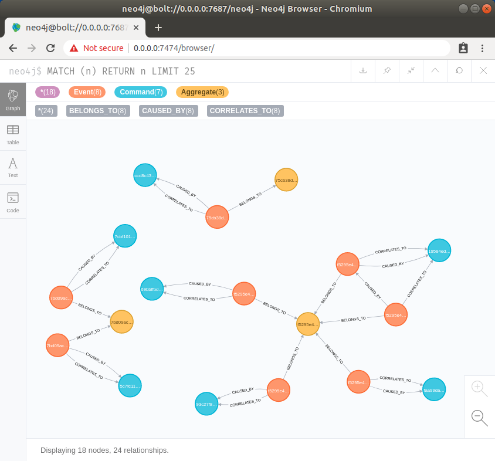

# Commander Neo4j



## Create constraints for import
```
CREATE CONSTRAINT ON (e:Event) ASSERT e.id IS UNIQUE
CREATE CONSTRAINT ON (c:Command) ASSERT c.id IS UNIQUE
```

## Import events
```
LOAD CSV WITH HEADERS FROM 'file:///events.csv' AS line
CREATE (e:Event {
    id: line.event_id,
    correlation_id: line.correlation_id,
    causation_id: line.causation_id,
    aggregate_id: line.aggregate_id,
    topic: line.topic
});

LOAD CSV WITH HEADERS FROM 'file:///commands.csv' AS line
MERGE (c:Command {
    id: line.command_id
});

LOAD CSV WITH HEADERS FROM 'file:///events.csv' AS line
MATCH (e:Event {id: line.event_id })
MATCH (c:Command {id: line.correlation_id })
CREATE (e)-[:CORRELATES_TO]->(c)
RETURN e, c;

LOAD CSV WITH HEADERS FROM 'file:///events.csv' AS line
MATCH (e:Event {id: line.event_id })
MATCH (c:Command {id: line.causation_id })
CREATE (e)-[:CAUSED_BY]->(c)
RETURN e, c;

LOAD CSV WITH HEADERS FROM 'file:///events.csv' AS line
MATCH (e1:Event {id: line.event_id })
MATCH (e2:Event {id: line.causation_id })
CREATE (e1)-[:CAUSED_BY]->(e2)
RETURN e1, e2;
```

## Match data

```
MATCH (n) RETURN n LIMIT 25
```

## Delete everything 
```
MATCH (n) DETACH DELETE n
```

## Drop constraints
```
DROP CONSTRAINT ON (e:Event) ASSERT e.id IS UNIQUE
DROP CONSTRAINT ON (c:Command) ASSERT c.id IS UNIQUE
```